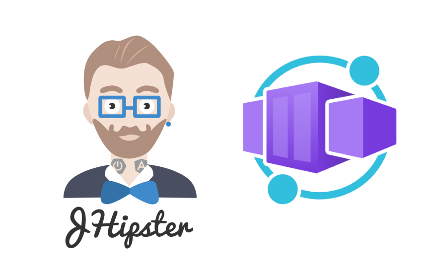
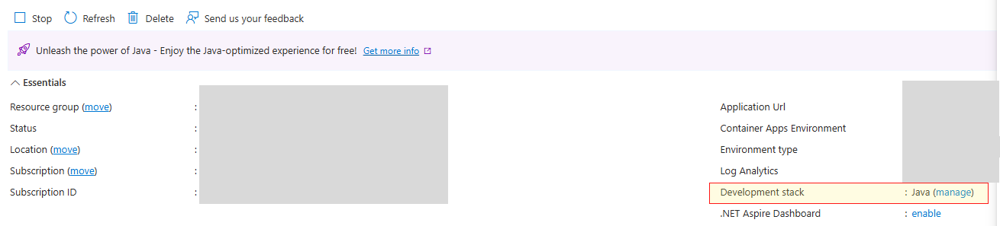

<div align="center">
    <a>
        
    </a>
    <h1>JHipster Azure Container Apps</h1>
</div>

---

[![NPM version][npm-image]][npm-url]

# Introduction

JHipster Azure Container Apps enables developers to rapidly create and deploy full-stack Java applications on [Azure Container Apps](https://learn.microsoft.com/azure/container-apps/java-overview) with minimal steps. This integration simplifies the deployment process, allowing seamless scalability and management for both frontend, backend and database services on Azure.

# Prerequisites

As this is a [JHipster](https://www.jhipster.tech/) blueprint, we expect you have JHipster basic knowledge:

- [JHipster](https://www.jhipster.tech/)

The following prerequisites arer equired to run this application locally. Please ensure that you have them all installed locally.

- [Java 17 or later](https://learn.microsoft.com/en-us/java/openjdk/install) - for API backend
- [Node.js](https://nodejs.org/) - for the Web frontend
- [Maven](https://maven.apache.org/download.cgi) - for local build

The following prerequisites arer equired to deploy this application to Azure.

- Azure Subscription: [Try Azure Container Apps for free](https://azure.microsoft.com/products/container-apps#Pricing). You can start with the free tier: The first 180,000 vCPU per second, 360,000 GiB/s, and 2 million requests each month are free.
- [Docker](https://www.docker.com/)
- [Azure Developer CLI](https://aka.ms/azd-install)

## 🚀 Get Started

```bash
npm install -g generator-jhipster-azure-container-apps
```

## 🚁 How to run locally

To use JHipster Azure Container Apps, run the below command

```bash
jhipster-azure-container-apps
```

You can look for updated azure-container-apps blueprint specific options by running

```bash
jhipster-azure-container-apps app --help
```

To run locally:

- For back-end, you can build manually under src/api with:

```bash
mvn clean package -DskipTests
java -jar target/{artifactname}-0.0.1-SNAPSHOT.jar
```

- The back-end can be accessed at:

```text
http://localhost:3100/
```

- For front-end, you can build manually under src/web with:

```bash
npm install
npm run dev
```

- The front-end can be accessed at:

```text
http://localhost:3000/
```

## 🎉 How to deploy on Azure for [free](<(https://azure.microsoft.com/products/container-apps#Pricing)>)

1. Log in to [azd](https://learn.microsoft.com/azure/developer/azure-developer-cli/install-azd). Only required once per-install.
   </br> `azd auth login`
   - If you are on Windows, install [powershell](https://learn.microsoft.com/powershell/scripting/install/installing-powershell-on-windows)
1. Navigate to the generated project directory and run
   </br>`azd up`
   **Make sure your docker is running when executing this.**

After the command is executed, you can see the following log signs that the deployment was successful.

```text
SUCCESS: Your up workflow to provision and deploy to Azure completed in <deployment-time>.
```

The output **Deploying service api** and **Deploying service web** are the endpoints to access the todo application.

## ❤️ Next Steps

Azure Container Apps has built-in Java support to enhance your Java applications with automatic memory fitting, diagnostics and managed spring componnets, [learn more](https://learn.microsoft.com/azure/container-apps/java-overview).
You can easily turn on the Java support feature by clicking on the **manage** of the Development stack and choose **Java** on your overview page.
.

[npm-image]: https://img.shields.io/npm/v/generator-jhipster-azure-container-apps.svg
[npm-url]: https://npmjs.org/package/generator-jhipster-azure-container-apps
[github-generator-image]: https://github.com/jhipster/generator-jhipster-azure-container-apps/actions/workflows/generator.yml/badge.svg
[github-generator-url]: https://github.com/jhipster/generator-jhipster-azure-container-apps/actions/workflows/generator.yml
[github-samples-image]: https://github.com/jhipster/generator-jhipster-azure-container-apps/actions/workflows/samples.yml/badge.svg
[github-samples-url]: https://github.com/jhipster/generator-jhipster-azure-container-apps/actions/workflows/samples.yml
